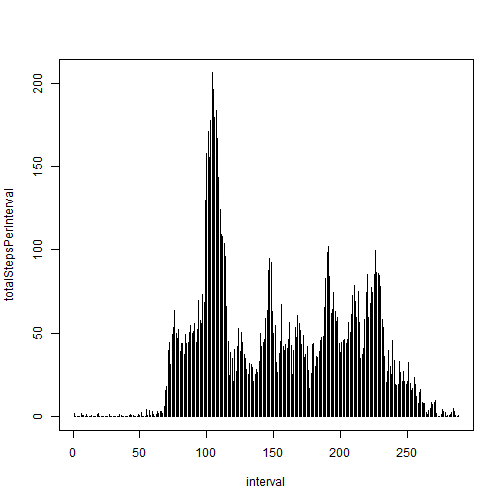

# Reproducible Research: Peer Assessment 1
# -----------------------------------------

# Short introduction

This assignment makes use of data from a personal activity monitoring device. This device collects data at 5 minute intervals through out the day. The data consists of two months of data from an anonymous individual collected during the months of October and November, 2012 and include the number of steps taken in 5 minute intervals each day.

The data for this assignment can be downloaded from the course web site:

* Dataset: [Activity monitoring data](https://d396qusza40orc.cloudfront.net/repdata%2Fdata%2Factivity.zip) [52K]

The variables included in this dataset are:

* **steps**: Number of steps taking in a 5-minute interval (missing
    values are coded as `NA`)

* **date**: The date on which the measurement was taken in YYYY-MM-DD
    format

* **interval**: Identifier for the 5-minute interval in which
    measurement was taken

The dataset is stored in a comma-separated-value (CSV) file and there are a total of 17,568 observations in this
dataset.

# Loading and preprocessing the data

Show any code that is needed to

## 1. Load the data (i.e. `read.csv()`)


```r
unzip("activity.zip") # Unzip archive  
dat <- read.csv("activity.csv") # Read in data file
head(dat)
```

```
##   steps       date interval
## 1    NA 2012-10-01        0
## 2    NA 2012-10-01        5
## 3    NA 2012-10-01       10
## 4    NA 2012-10-01       15
## 5    NA 2012-10-01       20
## 6    NA 2012-10-01       25
```
## 2. Process/transform the data (if necessary) into a format suitable for your analysis


```r
dates <- strptime(dat$date, "%Y-%m-%d")
dat$date <- dates
head(dat)
```

```
##   steps       date interval
## 1    NA 2012-10-01        0
## 2    NA 2012-10-01        5
## 3    NA 2012-10-01       10
## 4    NA 2012-10-01       15
## 5    NA 2012-10-01       20
## 6    NA 2012-10-01       25
```

# What is mean total number of steps taken per day?

(For this part, missing values can be ignored.)

## 1. Make a histogram of the total number of steps taken each day


```r
### First split up the data frame for steps by day
stepsSplit <- split(dat$steps, dates$yday)

### Next find the total number of steps over each day
totalStepsPerDay <- sapply(stepsSplit, sum, na.rm=TRUE)

### Plot the histogram where the x-axis denotes the day
### and the y-axis denotes the total number of steps taken 

hist(totalStepsPerDay, breaks=25, main="Histogram of steps taken each day", 
     xlab="Number of steps a day", ylab="Frequency (number of days)",  lwd=5, col="blue")
```

 
## 2. Calculate and report the **mean** and **median** total number of steps taken per day

### Mean

```r
meanStepsPerDay <- mean(totalStepsPerDay)
meanStepsPerDay
```

```
## [1] 9354.23
```
### Median

```r
medianStepsPerDay <- median(totalStepsPerDay)
medianStepsPerDay
```

```
## [1] 10395
```


# What is the average daily activity pattern?

## 1. Make a time series plot (i.e. `type = "l"`) of the 5-minute interval (x-axis) and the average number of steps taken,averaged across all days (y-axis)

```r
intervalSplit <- split(dat$steps, dat$interval)
totalStepsPerInterval <- sapply(intervalSplit, mean, na.rm=TRUE)
head(totalStepsPerInterval)
```

```
##         0         5        10        15        20        25 
## 1.7169811 0.3396226 0.1320755 0.1509434 0.0754717 2.0943396
```

```r
plot(totalStepsPerInterval,type = "h",xlab="interval")
```

 

## 2. Which 5-minute interval, on average across all the days in the dataset, contains the maximum number of steps?

```r
maxinterval=totalStepsPerInterval[1]
for (i in seq_along(totalStepsPerInterval)){
        if(totalStepsPerInterval[i]>maxinterval){
                maxinterval=totalStepsPerInterval[i]
        }        
                
}
maxinterval
```

```
##      835 
## 206.1698
```

```r
max(totalStepsPerInterval)
```

```
## [1] 206.1698
```
# Imputing missing values

Missing values are coded as `NA`. The presence of missing days may introduce bias into some calculations of the data.

## 1. Calculate and report the total number of missing values in the dataset (i.e. the total number of rows with `NA`s)

```r
numNA=sum(is.na(dat$steps))
numNA          
```

```
## [1] 2304
```
## 2. Devise a strategy for filling in all of the missing values in the dataset. The strategy does not need to be sophisticated For example, you could use the mean/median for that day, or the mean for that 5-minute interval, etc.

I will try the mean for that 5-minute interval. If the interval has also NA, then put zero.

## 3. Create a new dataset that is equal to the original dataset but with the missing data filled in.

```r
for (i in seq_along(dat$steps)){
        if(is.na(dat$steps[i])){
                dat$steps[i]=totalStepsPerInterval[as.numeric(dat$interval[i])/5+1]
        }        
if(is.na(dat$steps[i])){
                dat$steps[i]=0
                }
}
numNA2=sum(is.na(dat$steps))
numNA2
```

```
## [1] 0
```
## 4. Make a histogram of the total number of steps taken each day and Calculate and report the **mean** and **median** total number of steps taken per day. Do these values differ from the estimates from the first part of the assignment? What is the impact of imputing missing data on the estimates of the total daily number of steps?

```r
### First split up the data frame for steps by day
stepsSplit <- split(dat$steps, dates$yday)

### Next find the total number of steps over each day
totalStepsPerDay <- sapply(stepsSplit, sum, na.rm=TRUE)

### Plot the histogram where the x-axis denotes the day
### and the y-axis denotes the total number of steps taken 

hist(totalStepsPerDay, breaks=25, main="Histogram of steps taken each day", 
     xlab="Number of steps a day", ylab="Frequency (number of days)",  lwd=5, col="blue")
```

 
### Mean with NA's

```r
meanStepsPerDay
```

```
## [1] 9354.23
```
### Mean without NA's

```r
meanStepsPerDay <- mean(totalStepsPerDay)
meanStepsPerDay
```

```
## [1] 10282.14
```
### Median with NA's

```r
medianStepsPerDay
```

```
## [1] 10395
```
### Median without NA's

```r
medianStepsPerDay <- median(totalStepsPerDay)
medianStepsPerDay
```

```
## [1] 10395
```
### Imputting missing data narrows the diference between the mean and the median

# Are there differences in activity patterns between weekdays and weekends?

For this part the `weekdays()` function may be of some help. Use the dataset with the filled-in missing values for this part.

## 1. Create a new factor variable in the dataset with two levels -- "weekday" and "weekend" indicating whether a given date is a weekday or weekend day.

```r
dat$weekday<- as.factor(ifelse(weekdays(dat$date) %in% c("Saturday","Sunday"), "Weekend", "Weekday"))
head(dat)
```

```
##       steps       date interval weekday
## 1 1.7169811 2012-10-01        0 Weekday
## 2 0.3396226 2012-10-01        5 Weekday
## 3 0.1320755 2012-10-01       10 Weekday
## 4 0.1509434 2012-10-01       15 Weekday
## 5 0.0754717 2012-10-01       20 Weekday
## 6 2.0943396 2012-10-01       25 Weekday
```
## 2. Make a panel plot containing a time series plot (i.e. type = 1) of the 5-minute interval (x-axis) and the average number of steps taken, averaged across all weekday days or weekend days (y-axis). 

```r
dat1<-dat[dat$weekday=='Weekday',]
dat2<-dat[dat$weekday=='Weekend',]
head(dat2)
```

```
##      steps       date interval weekday
## 1441     0 2012-10-06        0 Weekend
## 1442     0 2012-10-06        5 Weekend
## 1443     0 2012-10-06       10 Weekend
## 1444     0 2012-10-06       15 Weekend
## 1445     0 2012-10-06       20 Weekend
## 1446     0 2012-10-06       25 Weekend
```

```r
intervalSplit1 <- split(dat1$steps, dat1$interval)
totalStepsPerInterval1 <- sapply(intervalSplit1, mean, na.rm=TRUE)
head(totalStepsPerInterval1)
```

```
##          0          5         10         15         20         25 
## 2.25115304 0.44528302 0.17316562 0.19790356 0.09895178 1.59035639
```

```r
intervalSplit2 <- split(dat2$steps, dat2$interval)
totalStepsPerInterval2 <- sapply(intervalSplit2, mean, na.rm=TRUE)
head(totalStepsPerInterval2)
```

```
##           0           5          10          15          20          25 
## 0.214622642 0.042452830 0.016509434 0.018867925 0.009433962 3.511792453
```

```r
par(mfrow=c(1,2))
plot(totalStepsPerInterval1,type = "h",xlab="weekday interval")
plot(totalStepsPerInterval2,type = "h",xlab="weekend interval")
```

 

### Clearly  there are differences in activity patterns between weekdays and weekends !!


### end
